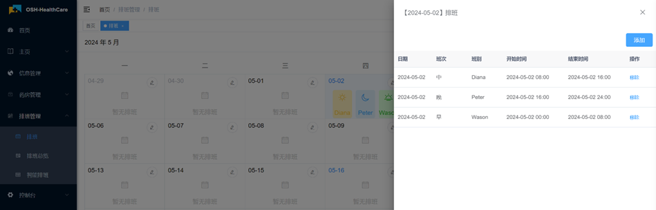
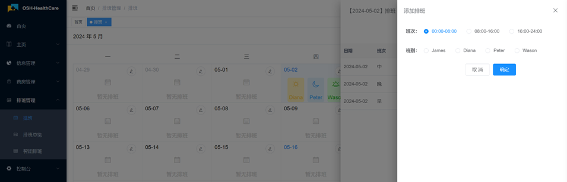
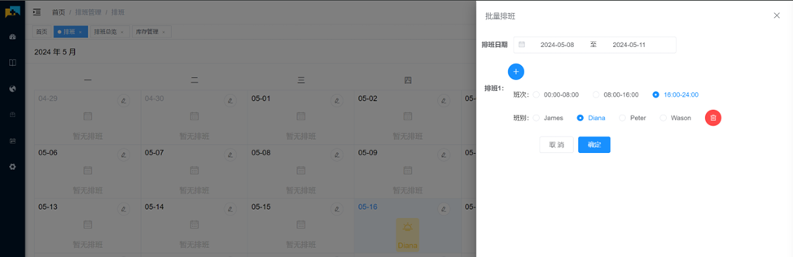

# OSH-HealthCare

一个基于 `RuoYi-Vue 3.8.7` 二次开发的医疗管理系统毕业设计项目，采用前后端分离架构，后端使用 Spring Boot，前端使用 Vue 2 + Element UI。

当前仓库主要包含医院后台管理端，已经实现的业务重点包括病床管理、药品库存、检查费配置、问诊管理、排班管理、Excel 导入导出，以及基于虹软 ArcFace 的人脸识别打卡功能。

## 项目特点

- 基于若依权限体系，保留了用户、角色、菜单、部门、日志、字典、通知等基础后台能力
- 扩展了医疗业务模块：病床、药品、检查费、问诊、排班总览、日历排班、智能排班
- 集成 `Google OR-Tools`，用于自动排班求解
- 集成 `ArcSoft ArcFace`，用于首页打卡的人脸比对
- 支持部分业务数据的 Excel 导入导出

## 技术栈

### 后端

- Java 8
- Spring Boot 2.5.15
- Spring Security
- JWT
- MyBatis
- Druid
- Redis
- Quartz
- Google OR-Tools

### 前端

- Vue 2
- Vuex
- Vue Router
- Element UI
- Axios
- ECharts

## 目录结构

```text
.
├── ruoyi-admin/        后端启动模块与自定义业务控制器
├── ruoyi-common/       公共模块
├── ruoyi-framework/    安全、配置、AOP 等基础框架
├── ruoyi-system/       若依系统模块
├── ruoyi-quartz/       定时任务模块
├── ruoyi-generator/    代码生成模块
├── ruoyi-ui/           前端项目
├── sql/                数据库脚本
├── showImg/            README 截图
├── doc/                补充文档
└── ArcSoft_ArcFace_Java_Windows_x64_V3.0/  虹软 SDK
```

## 功能模块

- 系统管理：用户、角色、菜单、部门、岗位、字典、参数、通知公告
- 系统监控：在线用户、登录日志、操作日志、服务监控、缓存监控、定时任务
- 病床管理：病床信息维护、导入导出
- 药品库存：药品信息维护、入库、出库
- 检查费设置：检查项目维护、导入导出
- 问诊管理：问诊记录查看、诊断填写、收费项目汇总
- 排班总览：排班列表维护、导入导出
- 日历排班：单日排班、批量排班、排班拖拽展示
- 智能排班：根据日期范围和医生列表自动生成排班结果
- 首页打卡：摄像头拍照 + 人脸比对

## 运行环境

推荐在 Windows 环境下运行本项目，尤其是涉及人脸识别功能时。

- JDK 8
- Maven 3.6+
- Node.js 14/16
- npm 6+
- MySQL 8.x
- Redis 6.x
- Windows 10/11（虹软 SDK 与当前代码中的路径配置更偏向 Windows）

## 快速开始

### 1. 克隆项目

```bash
git clone https://github.com/UltimateWilliamWu/HealthCare-Admin-Doctor.git
cd HealthCare-Admin-Doctor
```

### 2. 初始化数据库

1. 创建数据库，例如 `healthcare_system`
2. 导入 Quartz 表：

```sql
source sql/quartz.sql;
```

3. 导入若依基础表：

```sql
source sql/ry_20231130.sql;
```

注意：

- 当前仓库 `sql/` 目录只提供了若依基础表和 Quartz 表脚本
- 自定义医疗业务表（如病床、药品、检查、问诊、排班）以及药品出入库依赖的存储过程脚本没有一并提供
- 如果你希望完整跑通全部业务，需要自行补齐这些建表与存储过程 SQL

### 3. 修改后端配置

主要配置文件：

- `ruoyi-admin/src/main/resources/application.yml`
- `ruoyi-admin/src/main/resources/application-druid.yml`

你至少需要根据本机环境修改：

- MySQL 地址、库名、用户名、密码
- Redis 地址和密码
- 文件上传目录 `ruoyi.profile`
- 人脸识别相关本地路径

### 4. 处理虹软 ArcFace 依赖

仓库中包含虹软 SDK 文件，但当前 `pom.xml` 没有直接声明 ArcFace 的 Maven 依赖。如果你要使用或编译人脸识别功能，需要自行在本地工程中补齐该依赖配置。

当前代码还默认使用以下本地目录：

- `D:/OSH/uploadPath`
- `D:/OSH/`
- `D:/ArcSoft_ArcFace_Java_Windows_x64_V3.0/libs/WIN64`

因此如果直接运行，通常需要根据你的机器目录进行调整。

### 5. 启动后端

在项目根目录执行：

```bash
mvn clean package -DskipTests
java -jar ruoyi-admin/target/ruoyi-admin.jar
```

默认后端地址：

- `http://localhost:8080`

### 6. 启动前端

```bash
cd ruoyi-ui
npm install
npm run dev
```

默认前端地址：

- `http://localhost:80`

开发环境下前端会通过 `/dev-api` 代理到 `http://localhost:8080`

## 默认账号

根据 `sql/ry_20231130.sql` 中的初始化数据：

- 管理员：`admin / 123456`
- 普通角色：`ry / 123456`

## 项目截图

### 首页



### 功能页面示例 1



### 功能页面示例 2



## 当前已知问题

这些问题不是 README 的内容臆测，而是当前仓库代码本身就存在的使用前提或待完善点：

- 自定义医疗业务表 SQL 未随仓库完整提供，其他人无法只靠现有 `sql/` 目录完成初始化
- 药品入库/出库依赖数据库存储过程，但仓库内没有对应 SQL
- 人脸识别功能依赖 Windows 绝对路径、虹软密钥和本地 SDK 目录，移植性较差
- 项目中存在硬编码配置，直接公开仓库不利于安全
- 当前仓库没有自动化测试用例

## 答辩或展示时建议说明

- 本项目基于若依后台框架进行二次开发，重点工作在医疗业务模块设计与实现
- 智能排班模块引入了 OR-Tools 进行约束求解
- 人脸识别打卡使用虹软 ArcFace SDK 实现图片特征比对
- 当前仓库更偏向“毕业设计演示版/课程项目版”，部署到生产环境前还需要补齐安全配置、数据库脚本和测试

## 致谢

- [RuoYi-Vue](https://gitee.com/y_project/RuoYi-Vue)
- [Google OR-Tools](https://developers.google.com/optimization)
- ArcSoft ArcFace SDK

## License

本项目沿用仓库中的 [MIT License](LICENSE)。
