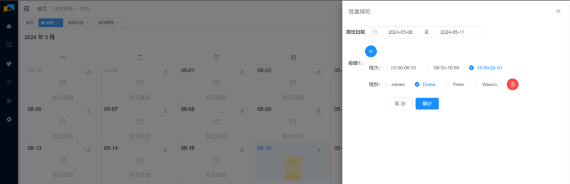

	

<h1 align="center" style="margin: 30px 0 30px; font-weight: bold;">OSH-HealthCare v1.0.0</h1>
<h4 align="center">基于Java若依快速开发框架的智能医疗健康系统（毕业设计）</h4>

    大学时期的毕业设计，水平有限，简单实现健康医疗系统

## 平台简介

若依是一套全部开源的快速开发平台，毫无保留给个人及企业免费使用。本系统是基于若依系统开发的医院信息管理系统，也将毫无保留地提供给学生和个人学习使用。

* 前端采用Vue、Element UI。
* 后端采用Spring Boot、Spring Security、Redis & Jwt。
* 权限认证使用Jwt，支持多终端认证系统。
* 支持加载动态权限菜单，多方式轻松权限控制。
* 高效率开发，使用代码生成器可以一键生成前后端代码。
* 提供了技术栈（[Vue3](https://v3.cn.vuejs.org) [Element Plus](https://element-plus.org/zh-CN) [Vite](https://cn.vitejs.dev)）版本[RuoYi-Vue3](https://github.com/yangzongzhuan/RuoYi-Vue3)，保持同步更新。
* 提供了单应用版本[RuoYi-Vue-fast](https://github.com/yangzongzhuan/RuoYi-Vue-fast)，Oracle版本[RuoYi-Vue-Oracle](https://github.com/yangzongzhuan/RuoYi-Vue-Oracle)，保持同步更新。
* 不分离版本，请移步[RuoYi](https://gitee.com/y_project/RuoYi)，微服务版本，请移步[RuoYi-Cloud](https://gitee.com/y_project/RuoYi-Cloud)

## 内置功能

### 管理员端（若依框架）
1.  用户管理：用户是系统操作者，该功能主要完成系统用户配置。
2.  部门管理：配置系统组织机构（公司、部门、小组），树结构展现支持数据权限。
3.  岗位管理：配置系统用户所属担任职务。
4.  菜单管理：配置系统菜单，操作权限，按钮权限标识等。
5.  角色管理：角色菜单权限分配、设置角色按机构进行数据范围权限划分。
6.  字典管理：对系统中经常使用的一些较为固定的数据进行维护。
7.  参数管理：对系统动态配置常用参数。
8.  通知公告：系统通知公告信息发布维护。
9.  操作日志：系统正常操作日志记录和查询；系统异常信息日志记录和查询。
10. 登录日志：系统登录日志记录查询包含登录异常。
11. 在线用户：当前系统中活跃用户状态监控。
12. 定时任务：在线（添加、修改、删除)任务调度包含执行结果日志。
13. 代码生成：前后端代码的生成（java、html、xml、sql）支持CRUD下载 。
14. 系统接口：根据业务代码自动生成相关的api接口文档。
15. 服务监控：监视当前系统CPU、内存、磁盘、堆栈等相关信息。
16. 缓存监控：对系统的缓存信息查询，命令统计等。
17. 在线构建器：拖动表单元素生成相应的HTML代码。
18. 连接池监视：监视当前系统数据库连接池状态，可进行分析SQL找出系统性能瓶颈。

### 医生端
1.  医生问诊：医生根据患者信息，给患者配药或者检查收费
2.  医生打卡：进入系统后医生可以根据人脸识别打卡
3.  查看排班：进入系统后可以查看排班
4.  手动排班：科室主管可以对科室的医生进行手动排班
5.  智能排班：选择排班日期范围以及需要进行排班的医生进行智能排班
6.  库存管理：根据需求对药品信息进行出入库管理

## 演示图

<table>
    <tr>
        <td>排班功能界面</td>
        <td>  </td>
    </tr>
    <tr>
        <td>手动排班界面</td>
        <td> </td>
    </tr>
    <tr>
        <td>批量排班界面</td>
        <td> </td>
    </tr>
</table>
